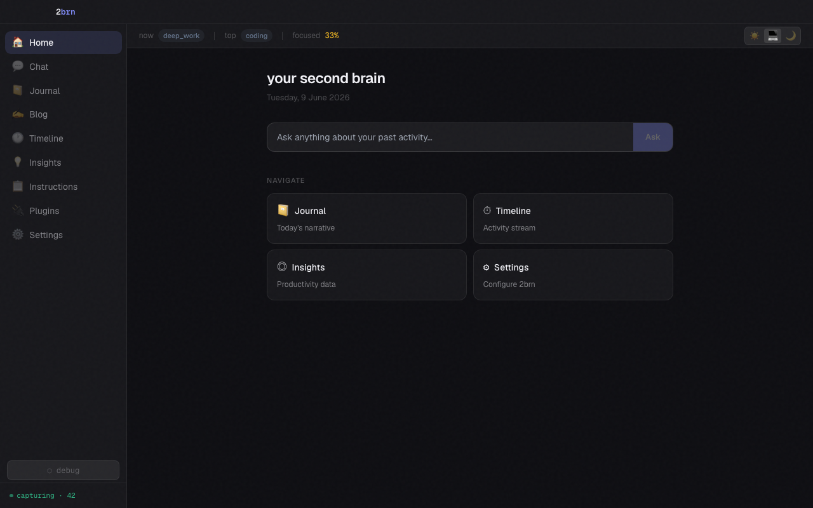
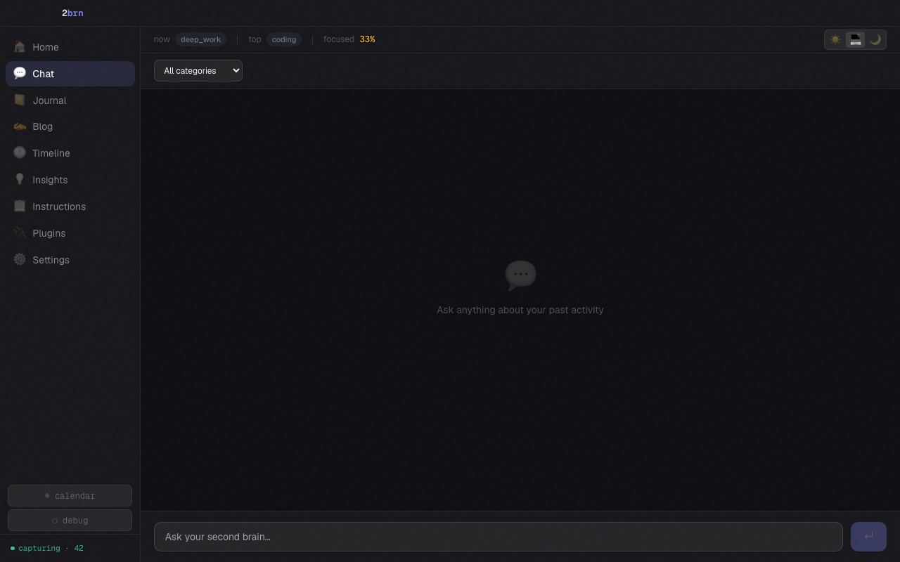
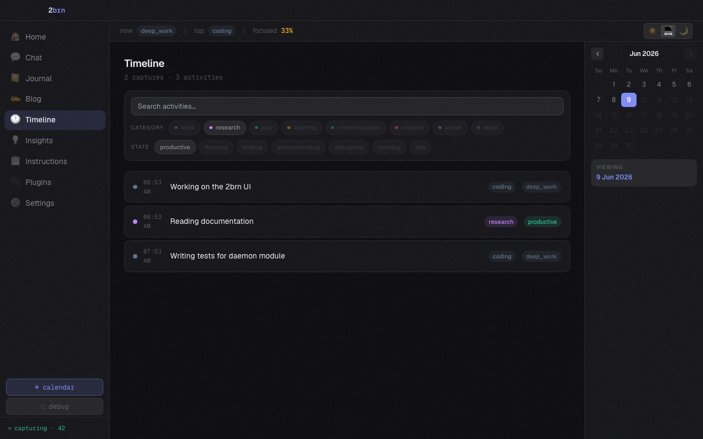
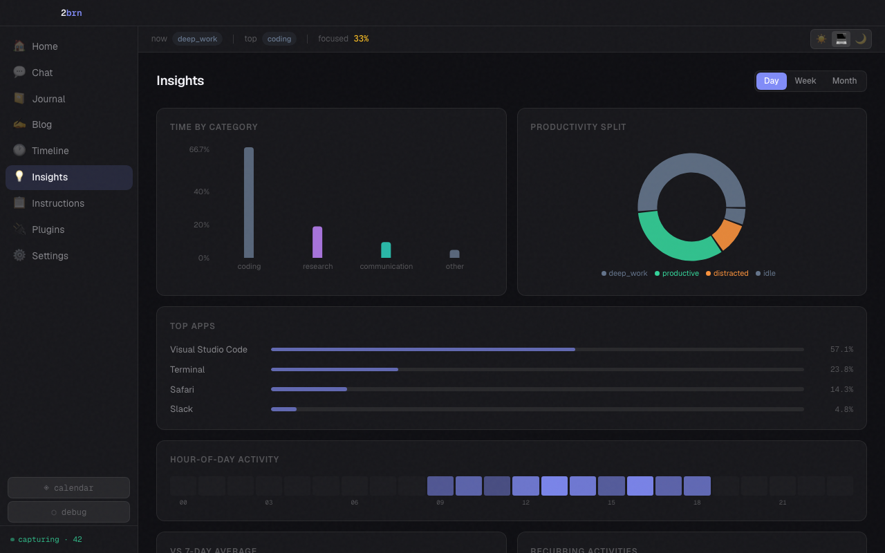
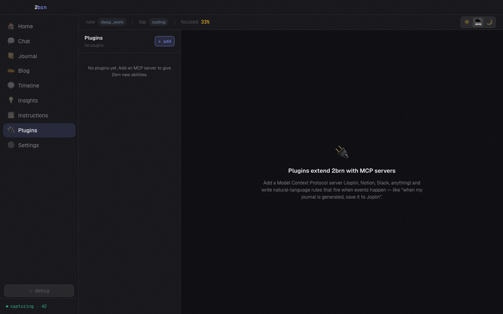

# 2brn — Second Brain

A local-first personal productivity companion. It periodically captures your
screen (and whenever the screen changes), runs OCR, uses an AI provider of your
choice to infer what you were doing, and gives you a chat interface, an
auto-written journal and blog, and productivity insights — all grounded in what
you actually did. Your data stays on your machine.



## Features

- 📸 **Screen capture** — multi-monitor screenshots, on a heartbeat *and* on
  visual change (perceptual-hash dedup, change captures rate-limited per
  monitor so videos don't capture at tick rate), with active-app detection
  and per-app exclusions; sampling backs off automatically (1s → 16s) while
  the screen is still, without delaying heartbeats
- 🔍 **OCR + AI inference** — Tesseract extracts text; your AI provider infers an
  activity summary, a task category (`work` / `research` / `play` / `learning` /
  `communication` / `creative` / `admin` / `other`) and a productivity state;
  heartbeat captures of an unchanged screen reuse the previous OCR text and
  classification instead of paying Tesseract + LLM again
  (`productive` / `focused` / `chilling` / `procrastinating` / `distracted` /
  `in-meeting` / `idle`)
- 💬 **Chat (RAG)** — ask questions about your day; answers are grounded in your
  activities (and embedded notes) via semantic search, streamed token-by-token
- 🧠 **Semantic search** — ChromaDB embeddings over every activity and note
- 📔 **Auto journal** — a daily journal written for you each evening
- ✍️ **Auto blog** — a longer-form post on a schedule you choose (daily / weekly /
  monthly)
- 📊 **Insights** — daily and weekly productivity breakdowns and a category/state
  heatmap
- 📋 **Instructions** — free-text guidance that steers how the AI writes your
  journal, blog, and chat replies
- 🔌 **Plugins (MCP)** — wire up outbound integrations (Joplin, Slack, Notion, …)
  as local MCP servers driven by plain-English rules — no code, no hardcoding
- 📱 **Mobile companion** — opt-in LAN bridge so a paired phone can save links/text
  into your second brain and read your journal & insights on the go
- 📓 **Joplin note embedding** *(optional)* — embeds your Joplin notes into the
  same semantic index as your screen activity, so chat can draw on both
- 🔐 **Screenshot encryption** — optional AES-256-GCM at-rest encryption for
  screenshots, keyed by a password held in the OS keychain
- 🖥️ **Cross-platform** — macOS, Windows, Linux via Electron + Python

## Screenshots

| | |
|---|---|
| **Chat**  | **Timeline**  |
| **Insights**  | **Plugins**  |

> The full set (every page, light & dark) lives in
> [`docs/screenshots/`](docs/screenshots/) — open `index.html` for the gallery.
> Regenerate it with `pnpm screenshots` from `ui/`.

## Prerequisites

- **Python 3.12+** with [uv](https://docs.astral.sh/uv/) installed
- **Node.js 20+** with [pnpm](https://pnpm.io/) installed
- **Tesseract OCR** — `brew install tesseract` / `apt install tesseract-ocr`
- **An AI provider** for chat and embeddings — any OpenAI-compatible endpoint works:
  - [OpenAI](https://platform.openai.com/) — `base_url: https://api.openai.com/v1`
  - [Ollama](https://ollama.com/) (local, no API key needed) — `base_url: http://localhost:11434/v1`
  - [LM Studio](https://lmstudio.ai/) (local) — `base_url: http://localhost:1234/v1`
  - [Groq](https://groq.com/), [Together AI](https://www.together.ai/), [Anthropic](https://anthropic.com/), or any other litellm-supported provider
  - Any OpenAI-compatible proxy or corporate gateway

## Quick Start

### 1. Start the daemon

```bash
cd daemon
uv sync
uv run python -m brn_daemon.main
```

The API comes up on `http://127.0.0.1:7842`. On first run it generates a
per-machine bearer token at `~/.2brn/api_token`; every endpoint except the
`/status` liveness probe requires it.

### 2. Start the UI

```bash
cd ui
pnpm install
pnpm electron:dev
```

### 3. Configure your AI provider

Open the app → **Settings** → fill in your **Chat Provider** and **Embed
Provider** details. Your API key is stored in the OS keychain (never written to
disk). Until a provider is configured, capture and OCR still run — inference,
chat, journal and blog wait for a reachable provider and heal once one is set.

## Architecture

```
┌──────────────────────────────────────────────────────────────────────┐
│  Electron UI  (React 19 · React Router · TanStack Query · Recharts)    │
│  Home · Chat · Journal · Blog · Timeline · Insights · Instructions ·   │
│  Plugins · Settings                                                    │
└───────────────────────────────┬────────────────────────────────────────┘
                                │  HTTP :7842  (bearer-token gated)
┌───────────────────────────────▼────────────────────────────────────────┐
│  Python Daemon  (FastAPI + APScheduler)                                │
│                                                                        │
│  capture loop ─► OCR ─► InferenceQueue ─► embed (ChromaDB) + SQLite    │
│  APScheduler  ─► journal / blog / purge jobs ─► EventBus               │
│  EventBus     ─► PluginOrchestrator ─► MCP servers over stdio          │
│  ChatService  ─► RAG over activities + notes ─► LLM (SSE stream)       │
│                                                                        │
│  LOCAL STORAGE              AI Provider (your choice)                  │
│  ~/.2brn/  (SQLite,    ←──► /v1/chat/completions                       │
│  ChromaDB, screenshots)     /v1/embeddings                             │
└──────────────────────┬─────────────────────────────────────────────────┘
                       │  opt-in LAN bridge (bind 0.0.0.0, same token)
┌──────────────────────▼─────────────────────────────────────────────────┐
│  Mobile companion (Android) — save-to-2brn share target + read journal │
└──────────────────────────────────────────────────────────────────────┘
```

See [`AGENTS.md`](AGENTS.md) for the module-level map and
[`docs/integrations.md`](docs/integrations.md) for the plugin/event design.

## Configuration

All config lives in `~/.2brn/config.json`; the easiest way to edit it is through
the **Settings** UI. API keys and the screenshot password never go in this file —
they live in the OS keychain.

| Setting | Key | Description |
|---|---|---|
| Chat provider | `chat_provider` | LLM for inference, journal, blog, and chat (`type`, `base_url`, `model`, optional `extra_headers`) |
| Embed provider | `embed_provider` | Embeddings for semantic search — `openai_compatible` or `custom` format |
| Capture interval | `capture_interval_seconds` | Heartbeat seconds between forced captures (default: `60`) |
| Purge after | `purge_months` | Auto-delete screenshots older than N months (default: `12`) |
| Paused | `paused` | Pause/resume capture |
| Excluded apps | `excluded_apps` | App names to never capture |
| Journal schedule | `journal_schedule` | `{hour, minute}` the daily journal is written (default: `21:00`) |
| Blog schedule | `blog_schedule` | `{frequency, hour, minute, day, days_of_week}` — `daily` / `weekly` / `monthly` |
| LAN access | `lan_access` | Bind `0.0.0.0` for the mobile companion (default: `false`; takes effect on restart) |
| Joplin embedding | `joplin_enabled`, `joplin_db_path` | Optional note embedding (default: off) |

### Embed provider types

- **`openai_compatible`** — standard OpenAI `/v1/embeddings` format
  (`{"input": [...]}` → `{"data": [{"embedding": [...]}]}`)
- **`custom`** — non-standard format used by some gateways
  (`{"inputs": [...]}` → `{"data": {"embeddings": [[...]]}}`)

## Plugins (outbound integrations)

Outbound integrations are not hardcoded — they're **plugins**: local MCP servers
2brn launches over stdio, driven by **natural-language rules** that fire on
internal events (`journal_generated`, `blog_generated`, `capture_inferred`, or a
schedule). A rule like *"When my journal is generated, save it as a Joplin note
titled with today's date"* is classified once by the LLM at save time, then
dispatched directly at runtime. Plugin secrets live in the OS keychain, never in
SQLite. See [`docs/integrations.md`](docs/integrations.md) for the full reference.

## Mobile companion

The daemon binds loopback by default. Setting `lan_access: true` (Settings, or
`PUT /settings`) makes it listen on `0.0.0.0:7842` after a restart so a phone on
the same Wi-Fi can reach it — still gated by the same bearer token. To pair a
phone, run the terminal helper, which prints the URL + token and a scannable QR:

```bash
cd daemon
uv run python -m brn_daemon.pair   # optional: uv pip install qrcode for the QR
```

The companion can then save links/text into your second brain (`POST
/ingest/note`, embedded alongside notes for chat RAG) and read your journal &
insights. Full contract: [`docs/mobile-bridge.md`](docs/mobile-bridge.md).

## Joplin integration *(optional)*

If you use [Joplin](https://joplinapp.org/), 2brn can embed your notes into the
same semantic index as your screen activity (read-only; it never writes to
Joplin). Enable it in **Settings → Joplin integration**. Mirroring journals
*back* to Joplin is now done as a plugin rule rather than core code — see
[`docs/integrations.md`](docs/integrations.md).

## Data & privacy

- All user data lives under `~/.2brn/` — SQLite database, ChromaDB index, and
  screenshots. Nothing leaves your machine except calls to the AI provider you
  configure (which can be fully local, e.g. Ollama / LM Studio).
- API keys, the screenshot password, and plugin secrets live in the **OS
  keychain** — only key *names* are stored in the database.
- The daemon is loopback-only unless you opt into `lan_access`, and every
  endpoint but `/status` requires the per-machine bearer token.
- Screenshots can be encrypted at rest with **AES-256-GCM**; the key is derived
  from a keychain-held password.

## Auto-start

### macOS (launchd)

```bash
cp daemon/com.2brn.daemon.plist ~/Library/LaunchAgents/
launchctl load ~/Library/LaunchAgents/com.2brn.daemon.plist
```

Windows and Linux auto-start are not yet wired up — start the daemon manually for
now. See [`docs/platform-daemon-autostart.md`](docs/platform-daemon-autostart.md)
for the options under consideration.

## Tech Stack

| Component | Technology |
|---|---|
| UI | Electron 31, React 19, TypeScript, Tailwind CSS, React Router, TanStack Query, Recharts |
| Daemon | Python 3.12, FastAPI, APScheduler, uvicorn |
| Capture | mss (multi-monitor), imagehash (perceptual-hash dedup) |
| OCR | Tesseract via pytesseract |
| LLM chat | litellm (100+ providers), SSE streaming via sse-starlette |
| Embeddings | Custom EmbedClient protocol (OpenAI-compatible + custom format) |
| Vector store | ChromaDB |
| Database | SQLite via aiosqlite |
| Plugins | Local MCP servers over stdio (stdlib JSON-RPC), APScheduler triggers |
| Encryption | AES-256-GCM via cryptography |
| Secrets | OS keychain via keyring |

## Development

```bash
# Daemon (from daemon/)
uv sync --extra dev
uv run ruff check src/                 # lint
uv run ruff format src/                # format
uv run pyright src/brn_daemon          # type-check
uv run --extra dev pytest tests/ -v    # tests (CI enforces 60% coverage)

# UI (from ui/)
pnpm exec tsc --noEmit                 # type-check
pnpm build                             # tsc + vite build
pnpm screenshots                       # regenerate docs/screenshots/
```

CI (`.github/workflows/ci.yml`) runs the daemon lint/type-check/tests (coverage
floor 60%) and the UI type-check/build. Optionally install the pre-commit hooks:
`cd daemon && uv run pre-commit install`.

## Contributing

Contributions are welcome! See [CONTRIBUTING.md](CONTRIBUTING.md) for setup, the
development workflow, and the project's design principles, and please review our
[Code of Conduct](CODE_OF_CONDUCT.md). To report a security issue, follow
[SECURITY.md](SECURITY.md) — don't open a public issue.

## License

[MIT](LICENSE) © 2026 SasidharanGS
